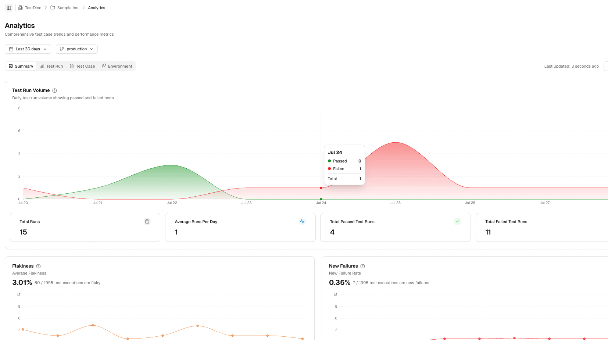

<p align="center">
  <a href="https://testdino.com" target="_blank" rel="noopener noreferrer">
    
  </a>
</p>

<p align="center">
  <a href="#why-testdino" >Why Testdino?</a> •
  <a href="#key-features" >Key Features</a> •
  <a href="#getting-started" >Getting Started</a> •
  <a href="#features-overview" >Features Overview</a> •
  <a href="#resources" >Documentations & Resources</a> •
  <a href="#contact">Contacts</a> 
</p>


<h3 align='center'> AI-Powered Playwright Test Report Analysis Platform </h3>

Testdino empowers QA and development teams to ship faster and with greater confidence by transforming raw Playwright test results into clear, actionable insights. Instead of sifting through noisy logs and endless reports, teams get instant visibility into what failed, why it matters, and what to do next. With AI-driven failure classification, trend analytics, and seamless integration into your existing workflow, Testdino eliminates manual triage and highlights the issues that truly impact your releases—so you can focus on building great products, not chasing test noise.


##  Why Testdino?


1. **Automates Manual Triage :** Engineers save 6-8 hours per week as Testdino automatically consolidates reports and analyzes failures, boosting productivity.

2. **Clarifies Failure Causes:** Testdino uses AI to classify failure reasons and highlight critical issues, enabling teams to resolve problems faster and with greater confidence.

3. **Centralizes Test Data :** All test runs, pull requests, branches, and environments are unified in one platform, giving teams a single source of truth and accelerating decision-making.


## Platform Overview


## Key Features

- **AI Failure Classification** - Automatically categorize as Actual Bug, UI Change, Unstable, or Misc
- **Role-Aware Dashboards** - QA, Developer, and Manager views with relevant metrics
- **PR-Aware Review** - See test results directly in your GitHub PR workflow  
- **Trend Analytics** - Track flakiness, new failures, retries, and execution speed over time
- **Smart Filtering** - Filter by period, status, committer, environment, and branch
- **Step-Level Evidence** - Screenshots, stack traces, and console logs for every failure
- **One-Click Integration** - Single CI step connects your existing Playwright setup
- **Team Collaboration** - Slack notifications, Jira/Linear bug creation, PR summaries
- **Cross-Environment** - Compare test performance across Prod, Staging, Dev environments
- **Release Readiness** - Get clear signals on what's safe to ship


##  Getting Started

### 1. **Create Your Account**
```bash
# Sign up at app.testdino.com
# Create Organization → Project → Generate API Key
```

### 2. **Add to Your CI Pipeline** 
```yaml
# GitHub Actions Example
- name: Run Playwright Tests
  run: npx playwright test --reporter=html,json

- name: Upload to Testdino  
  run: npx tdpw path/to/json/report --token ${{ secrets.TESTDINO_API_KEY }}
  if: always()
```

That's it! Your next test run will appear in Testdino with AI-powered insights, failure categorization, and actionable recommendations.

**[Complete Setup Guide →](https://docs.testdino.com/docs/playwright/)**


## Features Overview


###  **Dashboard - Your Test Health Control Center**

Get instant visibility with role-specific views over the period of 7/14/30 days:
- **QA Dashboard**: Failure categories, flaky tests, cross-environment performance
- **Developer Dashboard**: Active blockers, ready-to-ship PRs, flaky alerts, branch health  
- **Manager Dashboard**: Release readiness and stability at a glance

**Key Metrics at a Glance:**
- Total test executions, pass/fail counts, average duration
- AI-powered failure breakdown (Bugs vs Flaky vs UI Changes)
- Concise AI-driven insights highlighting critical issues, emerging trends, and optimization opportunities.
---
###  **Test Runs - Complete Execution Intelligence**


Every test execution tracked with full context:
- **Smart Summary**: Failed, Flaky, and Skipped breakdowns by technical cause
- **AI Insights**: Unique failures,Regression, New failures patterns, and categorization with filters  
- **Detailed Analysis**: Fast table with search tokens (`s:`, `c:`, `ai:`, `@`, `b:`)
- **Specs View**: File-centric overview with status bars and retry badges
- **History Trends**: Run history and execution time over recent builds
- **Test Case Deep Dive**: Status, AI labels, runtime, attempts, and full evidence
---
### **Pull Requests – Smarter, Test-Aware Code Reviews**

Supercharge your PR process with actionable test insights:
- **Live PR Test Status**: Instantly see the latest test results for every pull request, including pass/fail counts, durations, and flaky test alerts.
- **Full Run History**: Expand any PR to review all associated test runs, making it easy to track fixes, regressions, and test stability over time.
---
###  **Analytics - Data-Driven Test Optimization**
Turn test runs into actionable trends:
- **Run Volume Tracking**: Daily test execution patterns and coverage insights
- **Flakiness Analytics**: Average flakiness rates and unstable test identification  
- **Performance Metrics**: Speed trends, distribution analysis, and optimization targets
- **Environment Comparison**: Pass rates, execution counts, and performance across envs
- **Test Case Analysis**: Individual test trends, duration buckets, and status heatmaps

<!-- <center></center> -->

---

### **AI Features: Seamless Testing**


**Comprehensive AI-Driven Failure Categorization:**  
Automatically classifies test failures by type (Actual Bugs, UI Changes, Unstable Tests, Miscellaneous), assesses priority and impact, and provides branch-aware analysis to pinpoint areas most affected.

**Insightful Error and Trend Analysis:**  
Delivers actionable insights by tracking unique errors, distinguishing between emerging and persistent failure patterns, and visualizing error message trends and performance correlations over time.

**Concise Summaries:**
Provides AI-generated short summaries of test runs, highlighting major events and improvements — so teams instantly understand what happened without digging through logs.


---

###  **Integrations - Seamless Team Workflow**  
- **Issue Tracking**: Auto-create Jira/Linear tickets with full failure context
- **Communication**: Slack/Teams notifications with run summaries and quick links
- **Version Control**: GitHub integration with PR status and commit linking


## Upcoming Features : The Road Ahead
- **Advanced AI Insights** - Predictive failure analysis and trend forecasting
- **Multi-Framework Support** - Expand beyond Playwright to Cypress, Selenium
- **Custom Dashboards** - Build personalized views for your team's workflow
- **Test Impact Analysis** - Understand which tests matter for each code change


## Resources

### **Documentation**
- **[Website](https://testdino.com)** - Explore our website
- **[Getting Started](https://docs.testdino.com/docs)** - Complete setup guide in under 10 minutes
- **[Platform Guide](https://docs.testdino.com/docs/dashboard/)** - Dashboard, Test Runs, Analytics, and PR integration
- **[Integrations](https://docs.testdino.com/integrations)** - CI/CD, Jira, Linear, Slack setup guides  


### **Learning Resources**
- **[Video Tutorials](https://www.youtube.com/@Testdino1)** - Platform Walkthroughs
- **[Blog](https://testdino.com/blog)** - Testing insights and industry best practices


## Contacts 
- **Sales**: [sales@testdino.com](mailto:sales@testdino.com) 
- **Careers**: [careers@testdino.com](mailto:careers@testdino.com)


<p align="center" style="display: flex; gap: 32px; justify-content: center; align-items: center; flex-wrap: wrap;">
  <a href="www.testdino.com" target="_blank" rel="noopener noreferrer" title="Join our Discord">
   </a>
  </a>
 <a href="www.testdino.com"></a>
  <a href="https://www.linkedin.com/company/testdino" target="_blank" rel="noopener noreferrer" title="Connect on LinkedIn">
    
  </a>
</p>


---

<div align="center">

### **Ready to Transform Your Testing Workflow?**

**[🚀 Start Free Trial](https://testdino.com/)** • **[📖 Read Documentation](https://docs.testdino.com)** • **[💬 Join Community](https://discord.gg/testdino)**

*Built with ❤️ for the modern testing team*
